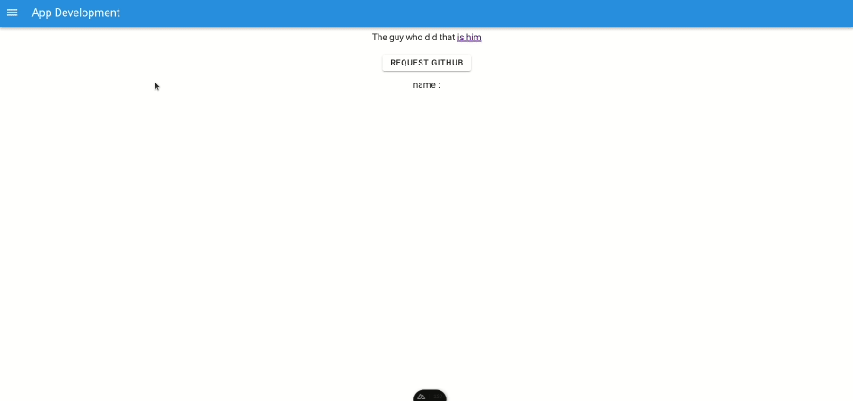

# Nuxt 3 Starter
A frontend starter with nuxt3 and essential plugins.

## prerequis
- node 20

## Plugins installed
- Vite (builder)
- Vuetify 3 (css)
- Material design icons (icons)
- i18n (internationalization)
- Pinia (Store)

## Default components
- App Bar
- Open-close App Menu
- Router
- Dark theme
- Reusable Snack that works with Pinia
- Reusable confirm dialog that works with Pinia

## Example

